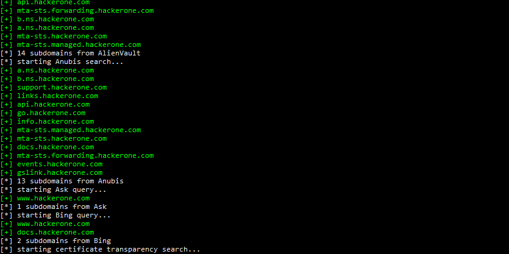

<h1 align="center">
  
  <br>
</h1>

<p align="center">
🍩
  <a href="#key-features">Key Features</a> •
  <a href="#how-to-use">How To Use</a> •
  <a href="#installation">Installation</a> •
  <a href="#acknowledgements">Acknowledgements</a>
🍺
</p>

<h1 align="center">
  
  <br>
</h1>

## Key Features
- 17 sources, currently all keyless (no subscriptions required)
- Asyncronous brute force with lots of pep, 2,000+ requests/s (depending on nameservers)
- Mutation brute forcing, i.e. permutations of discovered domains used in a brute force
- Recursive brute forcing that obeys the laws of thermodynamics
- Linux & Windows supported


#### Sources
[AlienVault](https://otx.alienvault.com/), [Anubis](https://github.com/jonluca/Anubis), [Ask](https://www.ask.com/), [Bing](https://www.bing.com/), [Certificate Search](https://crt.sh/), [DNSDumpster](https://dnsdumpster.com/), [DuckDuckGo](https://duckduckgo.com/), [Gist](https://gist.github.com/), [Google](https://www.google.com), [Hacker Target](https://hackertarget.com/), [RapidDNS](https://rapiddns.io/), [SonarSearch](https://sonar.omnisint.io/), [Threat Crowd](https://www.threatcrowd.org/), [ThreatMiner](https://www.threatminer.org/), [VirusTotal](https://www.virustotal.com/), [WayBack Machine](https://archive.org/web/), [Yahoo](https://yahoo.com/)

## How To Use
```
usage: snrublist3r.py [-h] -d DOMAIN [-b] [--subdomains SUBDOMAIN_FILE] [-m] [-p PERMUTATION_FILE] [-n NAMESERVER_FILE] [-t TASKS] [-o OUTPUT] [-v] [--proxy PROXY] [--autopilot] [-s SOURCES]
                      [--disable-scraping]

options:
  -h, --help            show this help message and exit

INPUT:
  -d DOMAIN, --domain DOMAIN
                        domain root
  -l LIST, --list LIST  input file of line-separated domains
  -b                    enable raw brute force
  --subdomains SUBDOMAIN_FILE
                        input file of line-separated subdomains used in the DNS brute force (default is bitquark-subdomains-top100000.txt)
  -m                    enable mutation brute force
  -p PERMUTATION_FILE, --permutations PERMUTATION_FILE
                        input file of line-separated permutations used in the mutation DNS brute force (default is permutations.txt)
  -n NAMESERVER_FILE, --nameservers NAMESERVER_FILE
                        input file of line-separated nameserver IPs used in the DNS brute force

SOURCE:
  -s SOURCES, --sources SOURCES
                        comma-separated list of sources, options are alienvault, anubis, ask, bing, certificatesearch, dnsdumpster, duckduckgo, gist, google, hackertarget, rapiddns, sonarsearch,
                        threatcrowd, threatminer, virustotal, waybackmachine, yahoo (default is all)
  --disable-scraping    disable scraping of any sources (use with brute force options)

RATE-LIMIT:
  -t TASKS, --tasks TASKS
                        number of concurrent tasks in the brute force queue (default is 512)

OUTPUT:
  -o OUTPUT, --output OUTPUT
                        output file to save results

CONFIGURATION:
  --proxy PROXY         proxy used for source scraper
  --autopilot           ignore input() prompts
  --max-alts MAX_ALTS   generated mutations limit, which if exceeded mutation brute force will not run (useful with --autopilot), default is ~500,000
  --recursive           enable recursive brute force

DEBUG:
  -v                    enable vebosity
  ```


#### Example Usage
##### Fast
```
python snrublist3r.py -d example.com -v --sources alienvault,anubis,certificatesearch,dnsdumpster,hackertarget,rapiddns,sonarsearch,threatcrowd,threatminer,virustotal,waybackmachine
```

##### Comprehensive
```
python snrublist3r.py -d example.com -v -b --subdomains ./lists/shubs-subdomains.txt -m
```

##### Brute Force only
```
python snrublist3r.py -d example.com -v -b --subdomains ./lists/shubs-subdomains.txt -m --disable-scraping
```

## Installation
#### Linux
```
git clone https://github.com/b3n-j4m1n/snrublist3r-private.git
cd snrublist3r
python -m venv snrublist3r
source ./snrublist3r/bin/activate
pip install -r requirements.txt
```

#### Windows
```
git clone https://github.com/b3n-j4m1n/snrublist3r-private.git
cd snrublist3r
python -m venv snrublist3r
.\snrublist3r\Scripts\Activate.ps1
pip install -r requirements.txt
```

## Acknowledgements
 - [Async DNS Brute](https://github.com/blark/aiodnsbrute) for the reference material for a fast as f*ck asynchronous DNS brute force.
 - [AltDNS](https://awesomeopensource.com/project/elangosundar/awesome-README-templates) for the subdomain mutation module.
 - [SecLists](https://github.com/danielmiessler/SecLists) for the wordlists.
 - [Sublist3r](https://github.com/aboul3la/Sublist3r), a brilliant tool with lots of well-thought-out, practical ideas. It is ensuring the finiancial security of bug hunting for years to come.