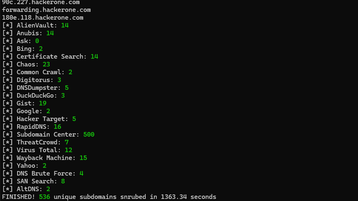

<h1 align="center">
  
  <br>
</h1>

<p align="center">
🍩
  <a href="#key-features">Key Features</a> •
  <a href="#how-to-use">How To Use</a> •
  <a href="#installation">Installation</a> •
  <a href="#acknowledgements">Acknowledgements</a>
🍺
</p>

<h1 align="center">
  
  <br>
</h1>

## Key Features
- 16 sources, currently all keyless (no subscriptions required)
- Asyncronous brute force with lots of pep, 2,000+ requests/s (depending on nameservers and network performance)
- Mutation brute forcing, i.e. permutations of discovered domains then used in a brute force
- Linux & Windows supported


#### Sources
[AlienVault](https://otx.alienvault.com/), [Anubis](https://github.com/jonluca/Anubis), [Ask](https://www.ask.com/), [Bing](https://www.bing.com/), [Certificate Search](https://crt.sh/), [Common Crawl](https://commoncrawl.org/), [Digitorus](https://www.digitorus.com/), [DNSDumpster](https://dnsdumpster.com/), [DuckDuckGo](https://duckduckgo.com/), [Gist](https://gist.github.com/), [Google](https://www.google.com), [Hacker Target](https://hackertarget.com/), [RapidDNS](https://rapiddns.io/), [VirusTotal](https://www.virustotal.com/), [WayBack Machine](https://archive.org/web/), [Yahoo](https://yahoo.com/)

## How To Use
```
usage: snrublist3r.py [-h] [-d DOMAIN] [-df DOMAINS_FILE] [-s SOURCES]
                      [--fast] [--proxy PROXY] [--disable-scraping] [-b]
                      [-sf SUBDOMAINS_FILE] [-nf NAMESERVERS_FILE]
                      [--tasks TASKS] [--timeout TIMEOUT]
                      [--dns-retries DNS_RETRIES] [-m]
                      [-pf PERMUTATION_FILE] [--autopilot] [--max-alts MAX_ALTS]
                      [--san] [--loop] [-o OUTPUT_FILE] [-v] [--debug]
                      [--silent]

optional arguments:
  -h, --help            show this help message and exit

TARGET(S):
  -d DOMAIN, --domain DOMAIN
                        root domain
  -df DOMAINS_FILE, --domains-file DOMAINS_FILE
                        input file of line-separated root domains

SCRAPING:
  -s SOURCES, --sources SOURCES
                        comma-separated list of sources, options are alienvault,
                        anubis, ask, bing, certificatesearch, commoncrawl,
                        digitorus, dnsdumpster, duckduckgo, gist, google,
                        hackertarget, rapiddns, virustotal, waybackmachine,
                        yahoo (default is all)
  --fast                run only fast scraping modules (excludes Common Crawl,
                        DuckDuckGo, Gist)
  --proxy PROXY         proxy used for source scraper, e.g.
                        'http://127.0.0.1:8080'
  --disable-scraping    disable scraping of any sources (use with brute force
                        options)

BRUTE FORCE:
  -b                    enable raw brute force
  -sf SUBDOMAINS_FILE, --subdomains-file SUBDOMAINS_FILE
                        input file of line-separated subdomains used in the DNS
                        brute force (default is bitquark-subdomains-top100000.txt)
  -nf NAMESERVERS_FILE, --nameservers-file NAMESERVERS_FILE
                        input file of line-separated nameserver IPs used in the
                        DNS brute force
  --tasks TASKS         number of concurrent tasks in the brute-force queue
                        (default is 256)
  --timeout TIMEOUT     timeout on DNS resolution (default is 5)
  --dns-retries DNS_RETRIES
                        retries for DNS resolution (default is 2)
  -m                    enable mutation brute force
  -pf PERMUTATION_FILE, --permutation-file PERMUTATION_FILE
                        input file of line-separated strings used in the
                        mutation DNS brute force (default is
                        snrubutation-strings.txt)
  --autopilot           ignore input() prompts
  --max-alts MAX_ALTS   generated mutations limit, which if exceeded the
                        mutation brute force will not run (useful with
                        --autopilot), default is ~500,000

SAN SEARCH:
  --san                 enable Subject Alt Names search

CONFIGURATIONS:
  --loop                run in a continuous loop

OUTPUT:
  -o OUTPUT_FILE, --output OUTPUT_FILE
                        output file to save results

VERBOSITY:
  -v                    enable verbosity
  --debug               enable debug log level
  --silent              disable terminal output
  ```


#### Example Usage
##### Fast
```
python snrublist3r.py -d example.com -v --fast
```

##### Comprehensive
```
python snrublist3r.py -d example.com -v -b --subdomains ./lists/shubs-subdomains.txt -m
```

##### Brute Force only
```
python snrublist3r.py -d example.com -v -b -m --disable-scraping
```

🧠 _Note: The system DNS resolver will be used by default, so in the interests of going fast and not DoS'ing yourself it's recommended to not do this and instead use the_ `-nf` _option with the provided ./lists/top-resolvers.txt, this will rotate through Cloudflare, Google, OpenDNS, and Quad9 DNS resolvers._

## Installation

**Python 3.9.0+** is recommended for use of removeprefix() function

#### Linux
```
git clone https://github.com/b3n-j4m1n/snrublist3r-private.git
cd snrublist3r
python -m venv snrublist3r
source ./snrublist3r/bin/activate
pip install -r requirements.txt
```

#### Windows
```
git clone https://github.com/b3n-j4m1n/snrublist3r-private.git
cd snrublist3r
python -m venv snrublist3r
.\snrublist3r\Scripts\Activate.ps1
pip install -r requirements.txt
```

## Acknowledgements
 - [Async DNS Brute](https://github.com/blark/aiodnsbrute) for the reference material for a fast as f*ck asynchronous DNS brute force.
 - [AltDNS](https://awesomeopensource.com/project/elangosundar/awesome-README-templates) for the subdomain mutation module.
 - [SecLists](https://github.com/danielmiessler/SecLists) for the wordlists.
 - [resolvers](https://github.com/trickest/resolvers) for the resolvers.
 - [Sublist3r](https://github.com/aboul3la/Sublist3r), a brilliant tool with lots of well-thought-out, practical ideas. It is ensuring the finiancial security of bug hunting for years to come.